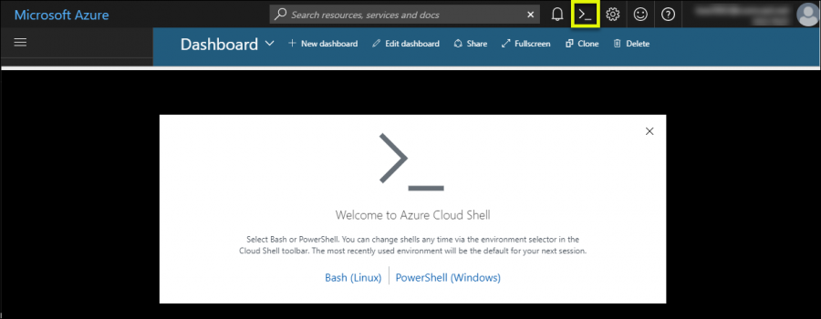

## AML-Setup
Bash Script for Azure ML Workspace Setup

## Execute in Azure Cloud Shell


## Execute the following command:
Note: You can change PREFIX and LOCATION in create-env.sh (optional). Current script creates resources with prefix **amlwstemp** in **westeurope** region.

Clone Git Repository
```sh
$ git clone https://github.com/mozamani/aml_workshop_template
``` 
Access AML-Setup Folder
```sh
$ cd 0-Setup/CLI/
``` 
Execute Bash Script
```sh
$ . create-env.sh
``` 

## The following ressources are going to be deployed


* Azure Key Vault
* Azure Machine Learning Workspace
* Azure Storage Account
* Azure Application Insights
* Azure Container Registry

