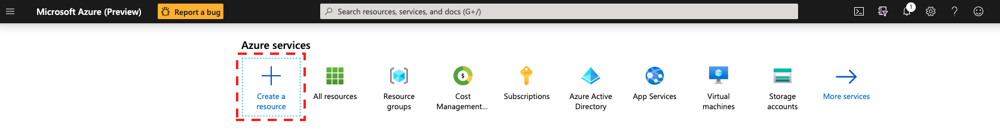
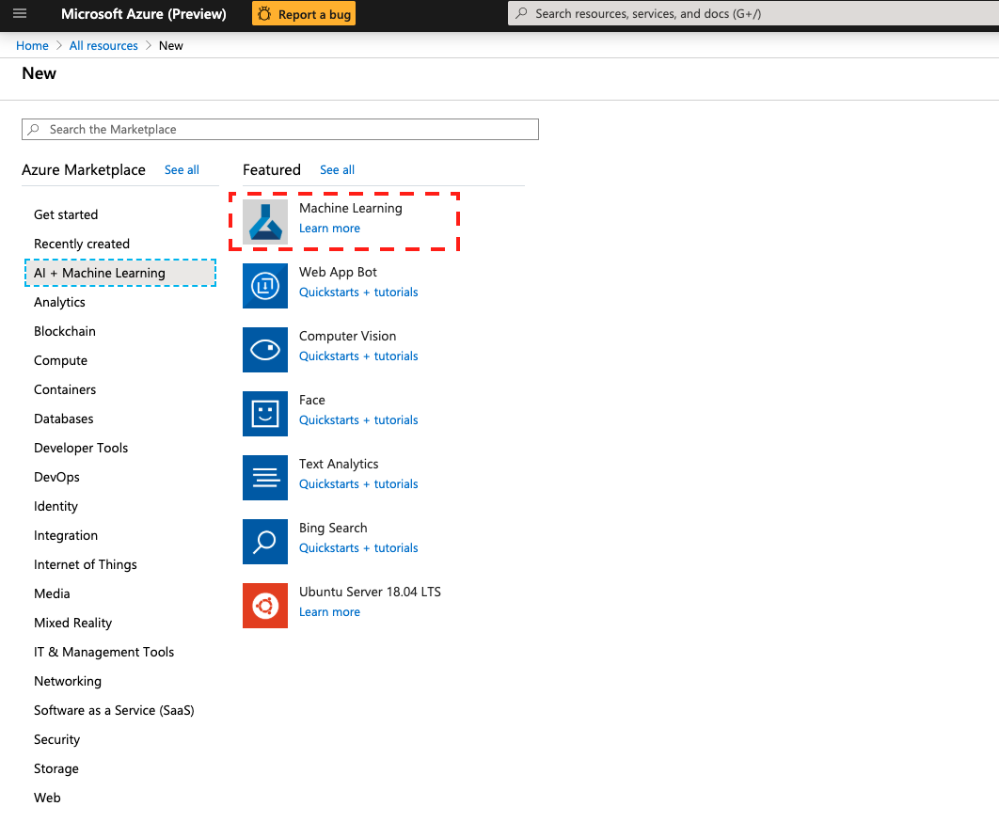

# Create an AzureML workspace via Azure Portal UI

1. In you Azure portal navigate to 'Create a resource' and click.

2. In 'Azure Marketplace' tab navigate to 'AI + Machine Learning' tab select 'Machine Learning' and click.

3. Type a name for the workspace and select (or create a new) resource group, location and edition of the workspace (see details [here](https://docs.microsoft.com/en-us/azure/machine-learning/overview-what-is-azure-ml#sku)). Click on "Review + Create" and then "Create".

4. Wait for deployment and then click on "Go to resource"

5. In the resource blade, you have access to all the meta data needed to refer to your workspace e.g. name, resource group, etc. (you can download all these info as a json file, "config.json"). To access Azure Machine Learning Studio click on "Launch now"

