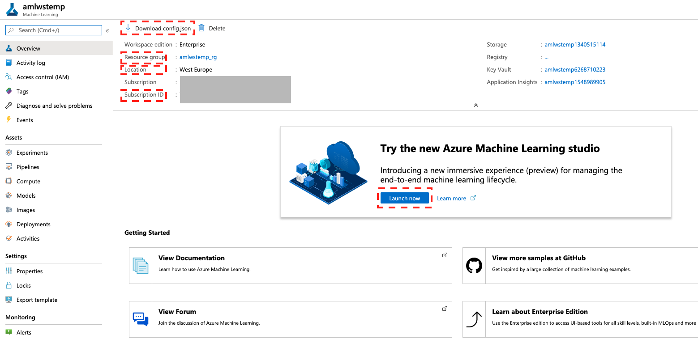

# Create an AzureML workspace via Azure Portal UI

1. In you Azure portal navigate to 'Create a resource' and click.

2. In 'Azure Marketplace' tab navigate to 'AI + Machine Learning' tab select 'Machine Learning' and click.

3. 

