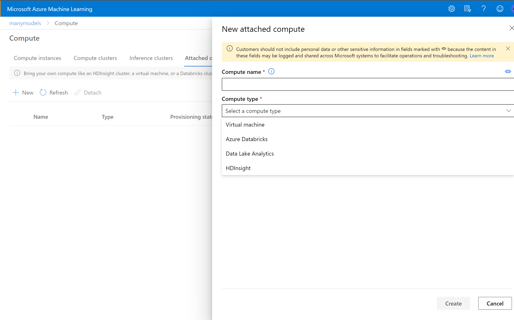

# Compute in Azure Machine Learning

AML offers a wide range of compute:

• Compute instances: previously known as notebook vm's. Mostly used as development environments although they can also be used as a compute target for training and inferencing for development and testing. 
• Compute clusters: In case multi-node scaling capabilities are needed one could create a compute cluster.
• Inference clusters: Creating or connecting to an existing Azure Kubernetes cluster used for inferencing in both dev-test and production.
• Attached compute: AML also allows for attaching different compute options are: virtual machine, Azure Databricks, Data Lake Analytics & HDInsight.

 For more information regarding compute instance go to: https://docs.microsoft.com/en-us/azure/machine-learning/concept-compute-instance
