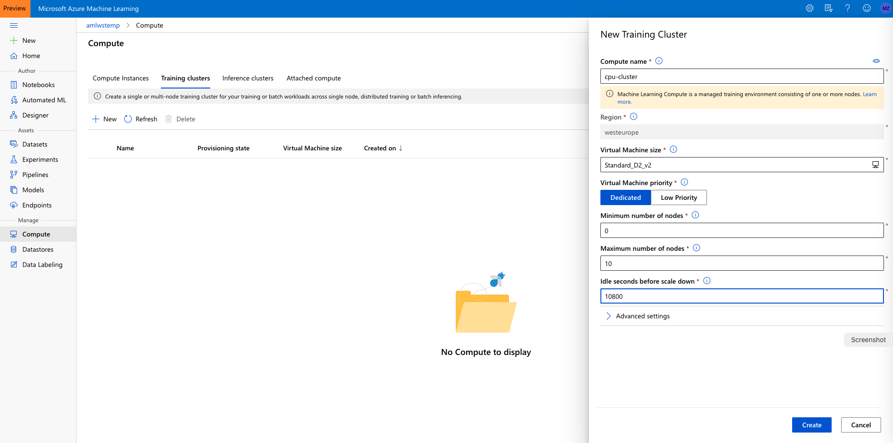

# Setting up the Compute Targets

## Prerequisites

To run through below instructions, you need an Azure subscription and an Azure ML workspace. See instructions on how to create a workspace [here](../../../0-Setup/README.md) and more details [here](https://docs.microsoft.com/en-us/azure/machine-learning/service/how-to-manage-workspace).

## Creating an AzureML compute cluster

We will do a number of actions that require a compute target to be exectuted on. We will start by creating a cluster of CPU VMs.

1. Navigate to 'Compute' > 'Training Clusters' in the "Manage" section and click 'New'.

1. Call the cluster 'cpu-cluster'.
    - For machine size choose 'Standard_D2_v2' (that is an inexpensive general purpose VM size at about $0.14/hour). See details about AzureML compute pricing [here](https://azure.microsoft.com/en-us/pricing/details/machine-learning/).
    - Set the 'minimum number of nodes' to 0 and the  the 'maximum number of nodes' to 10. That way the cluster will scale automatically to up to 10 nodes as jobs require them.
    - Set the 'Idle seconds before scale down' to 10800. That means that nodes will be kept around for 3 hours before they are spun down. That way, during our workshop, jobs won't have to wait for spin-up. Make sure that number is lower if you are using a more expensive VM size.

## Creating an AzureML Compute Instance

Next, we will create a compute instance. The compute instance will serve as an interactive workstation in the cloud that serves as a Jupyter server, but also hosts and instance of RStudio server and can run TensorBoard, Bokeh, Shiny or other apps used during the developement work of a data scientist.

1. Navigate to 'Compute Instance' tab in Compute and click on 'New'.
 
1. Choose some sufficiently unique name, keep the default VM type (STANDARD_DS3V2 -- a fairly inexpensive machine type costing about $0.27/hour) and click 'Create':

See [here](https://docs.microsoft.com/en-us/azure/machine-learning/service/how-to-configure-environment#notebookvm) for details on creating AzureML Notebook VMs.

**Note that this machine will keep running until you stop it from the portal.**
