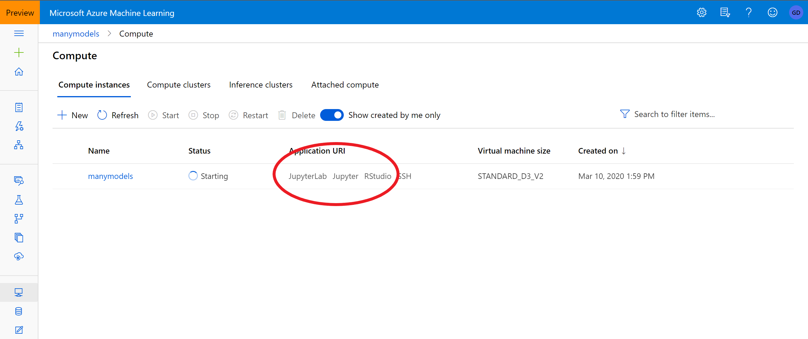
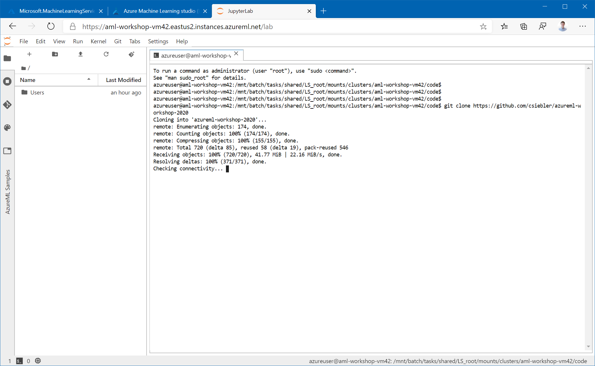
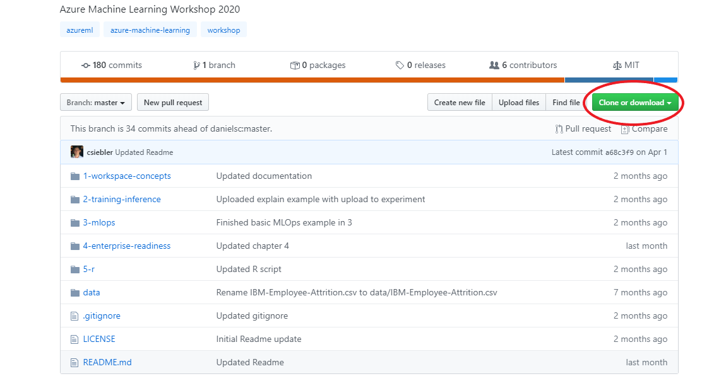
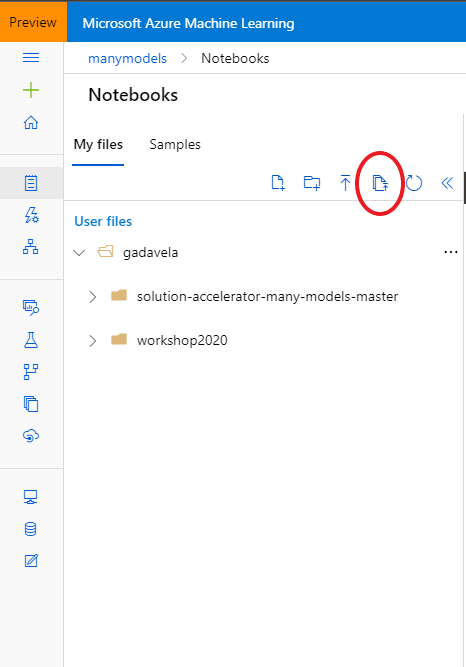

# Clone git Repository to Workspace storage

For the following parts of the workshop, you are going to work on the compute instance you created earlier [earlier](1-setup-compute.md). For that, you will need to clone this git repository onto the workspace.

1. To get started, there are a few possibilities: using the applications such as JupyterLab, Jupyter, Rstudio or use the notebook functionality within Azure Machine Learning. Make sure the status of your compute instance is **running**.

2. After going through authentication, you will see the JupyterLab frontend. As you authenticate, make sure to use the same user to log in as was used to create the Compute Instance, or else your access will be denied. Next open an Terminal (either by File -> New -> Terminal, or by just clicking on Terminal in the Launcher Window).

3. In the terminal window clone this repository by typing:

git clone https://github.com/csiebler/azureml-workshop-2020

** Please note: make sure you are in the right folder in order for you to see it in the Azure Machine Learning notebook**

# Second option - upload the github repo in AML notebook

1. Download the repo in a zip file. Unzip it locally.

2. Upload the folder in the Azure Machine Learning notebook.

