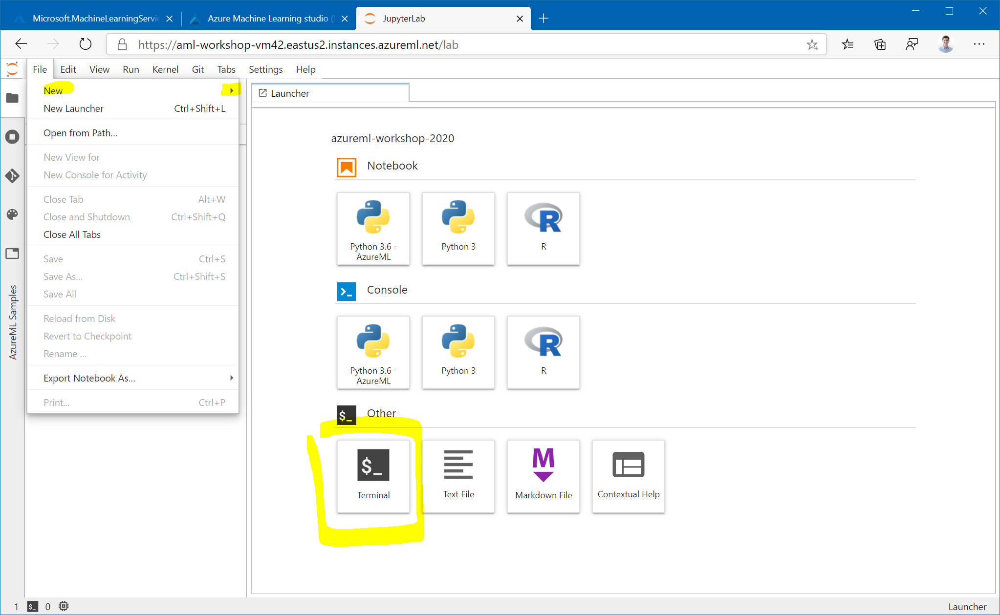

# Clone git Repository to Workspace storage

For the following parts of the workshop, you are going to work on the compute instance you created earlier [earlier](1-setup-compute.md). For that, you will need to clone this git repository onto the workspace.

1. To get started, there are a few possibilities: using the applications such as JupyterLab, Jupyter, Rstudio or use the notebook functionality within Azure Machine Learning. Make sure the status of your compute instance is **running**.


2. For this workshop navigate to the Notebooks within Azure Machine Learning UI. Which can be found on the left pane with the notebook icon.



3. The easiest way to get these folders onto a compute instance in the portal is to upload the repo as a zip file and run ```!unzip solution-accelerator-many-models.zip``` in a Jupyter Notebook or in the terminal.


