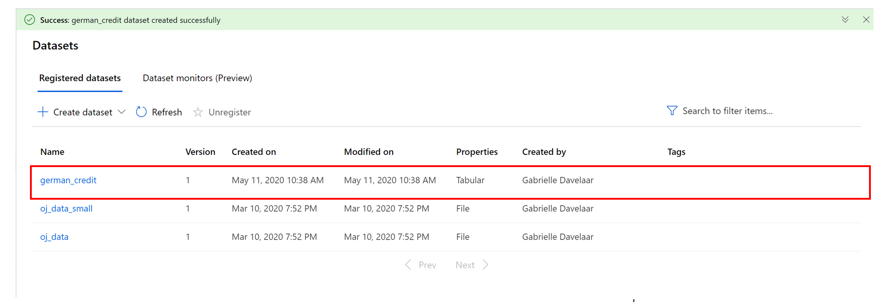
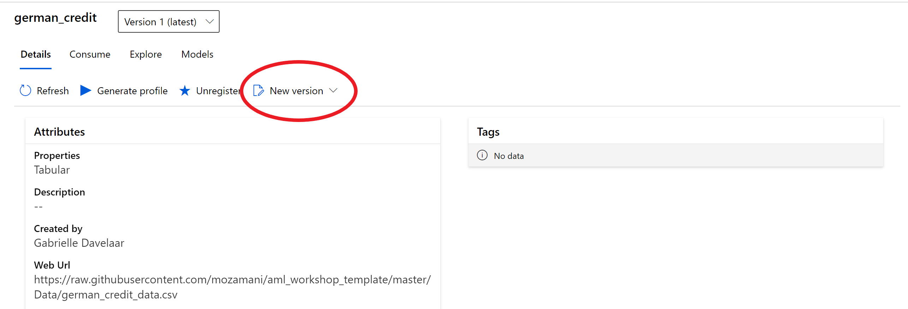
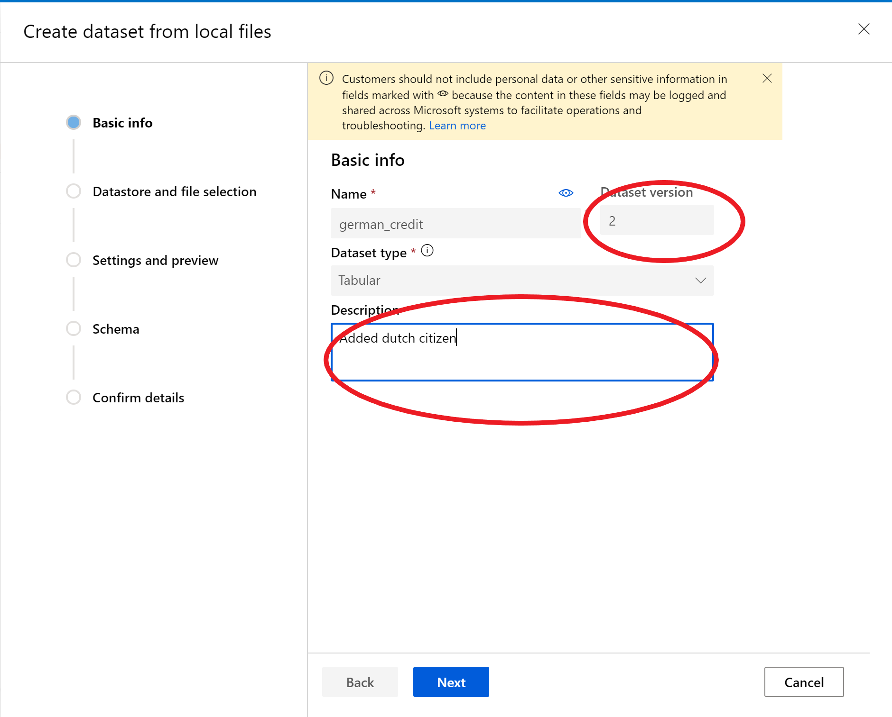
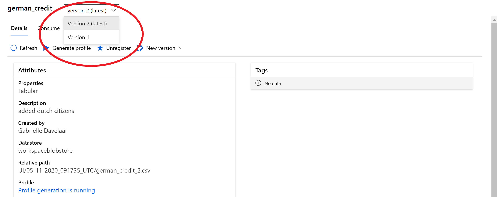

## Creating a second version of the dataset

Step 1: Go to **datasets**, click on the **dataset** you have a new version for:

Step 2: click on **new version** and choose from which location you want to pick up the new version:

Step 3: Fill in the necessary information (e.g. what type of change happened in the description) walk through the same steps as in part 1 (datastore and file section, setting and preview, schema, confirm details). Notice that in basic information it automatically states which version this is of the dataset and the ability to add a description to what has changed (red circles).

Step 4: when the new dataset is uploaded, two versions of the capadataset can be found.

This is the end of part 1 of the workshop focused on loading datasets into AML and how to version those datasets. 