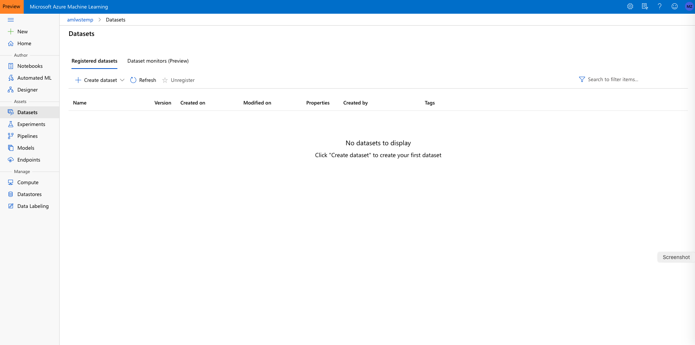
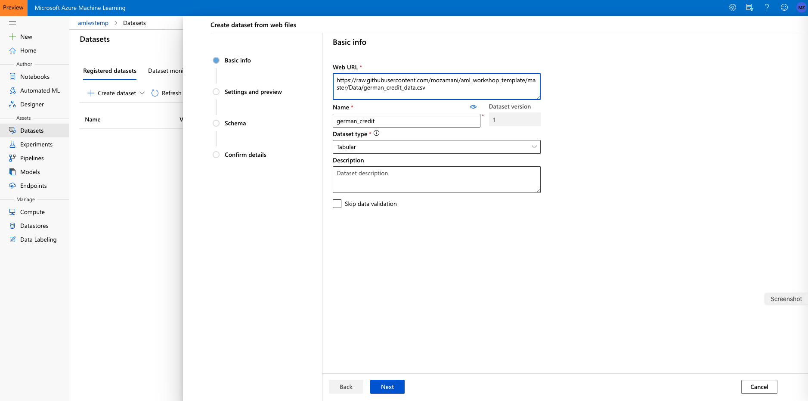
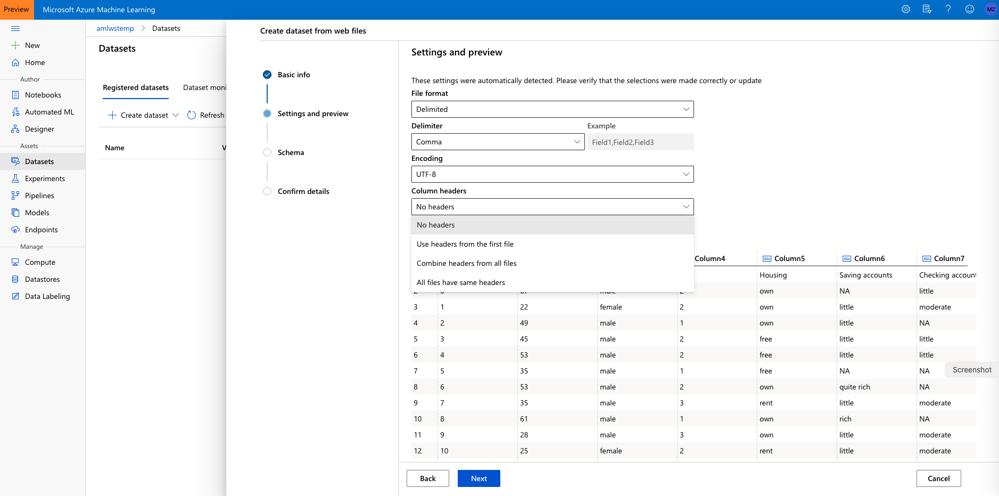
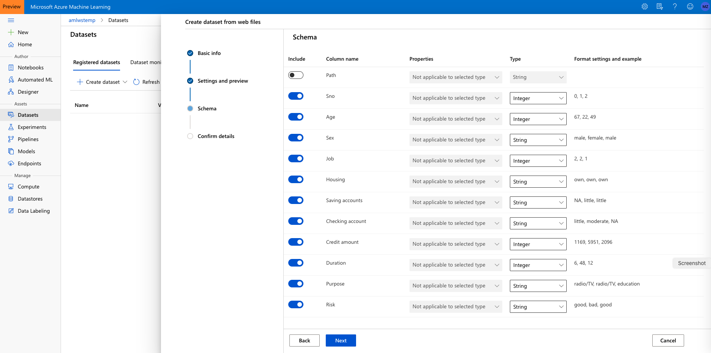
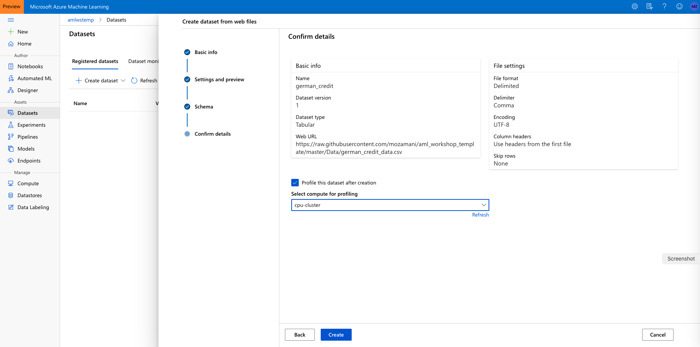
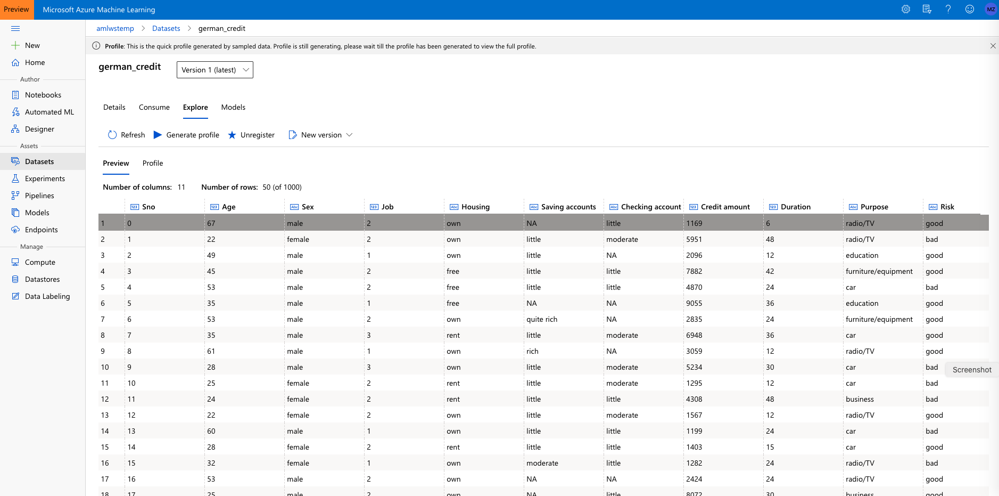
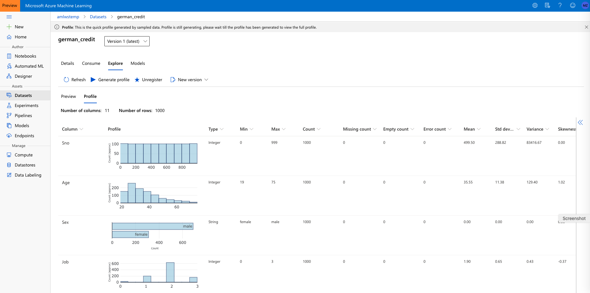
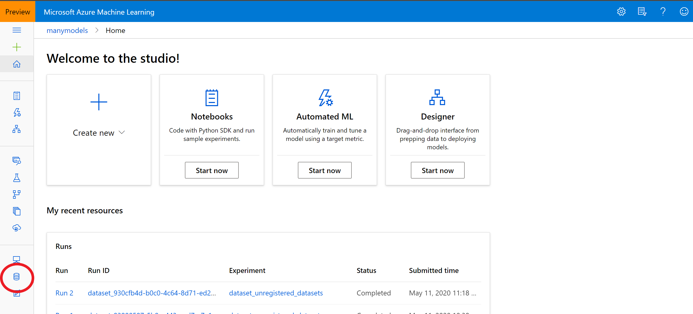
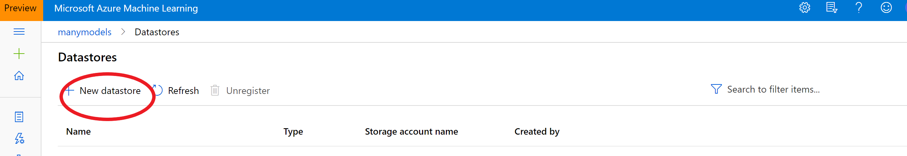

# Datasets and Datastores

The AzureML studio allows the user to manage their dataset and datastores directly inside the portal. 

A Dataset is a resource for exploring, transforming and managing data in Azure Machine Learning. 
Datasets enable:

- Easy access to data: without worrying about connection strings or data paths. Only keep a single copy of data in the storage service of your choice.

- Training with big data: seamless integration with Azure Machine Learning features like labelling, training products and pipelines. Users can share and reuse datasets in various experiments.

- Tracking data usage: Azure ML automatically tracks which version of the dataset was used for the ML experiment and produced which model.

## Uploading a Dataset to AzureML studio

1. Here we are using German credit dataset: https://raw.githubusercontent.com/mozamani/aml_workshop_template/master/Data/german_credit_data.csv

2. Navigate to the left pane of your workspace. Select Datasets under the Assets section

Click on 'Create dataset' and choose 'From web files'. Copy/Paste the above URL in the Web URL box, name the dataset '**german_credit**' and then click 'Next'. Make sure to leave the dataset type as Tabular.

3. From 'Column headers' drop-down select 'Use headers from the first file'

4. Click 'Next' through the following "Settings and preview" and "Schema" sections to verify that everything looks correct.

5. Finally, in the "Confirm Details" section, select "Profile this dataset after creation" and specify the 'cpu-cluster' that you previously created as the compute to use for profiling

## Explore the dataset

1. Now, click on the newly created dataset and click 'Explore'. Here you can see the fields of the Tabular dataset.

1. To view the profile of the dataset we generated in the previous step, click the "Profile" tab. If you want to regenerate a profile (or you created the dataset without selecting the profile option), you can  click "Generate profile" and select a cluster to generate profile information for the dataset.

For more information on datasets, see the how-to for more information on creating and using Datasets. https://docs.microsoft.com/en-us/azure/machine-learning/service/how-to-create-register-datasets

## [Optional] - creating a datastore

In case data, residing in an Azure Storage, is being loaded into Azure Machine Learning one should create a datastore first.
For this it is important to have an Azure storage account with an Azure blob container or Azure file share. Link to create an Azure storage account: https://docs.microsoft.com/en-us/azure/storage/blobs/storage-blob-create-account-block-blob?tabs=azure-portal

1. Click 'Datastores' on the left pane under Manage.

2. Click create 'New datastore'.

3. Fill in the form for a new datastore. 

Information regarding the SAS token can be found in Access keys on the settings pane. For service principals navigate to App registrations and select the designated app.

For more information on how to access data please check the following link: https://github.com/microsoft/azure-docs/blob/master/articles/machine-learning/how-to-access-data.md

