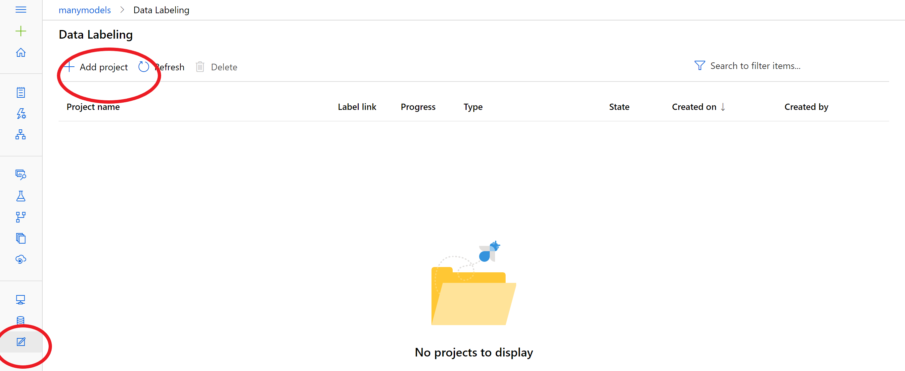

# [OPTIONAL] Data labeling for computer vision projects

Prerequisites:

Find 10 pictures of your favorite animal. Next find 10 pictures where your favorite animal is in the picture with another animal.

Upload them in a dataset using **files**, check out the previous step 2 to find a tutorial on how to create a dataset.

## Creating a project

1. Click **Data Labeling** on the left-hand side and Click **Add project** (red circles).

2. Fill in the project details, for this exercise choose object identification in the **labeling task type**

3. In the second part you have two options: you can either create a dataset or select an existing one.

4. Click **next** to continue creating the project.

## Labeling data - object identification

1. For object identification a bounding box tool will be made available like below:

2. First indicate the tag, followed by clicking the second icon on the left, lastly drag the box around to object (the bounding box).

3. You have the following additional options: 

- Use the first icon on the left for region maniupulation. Drag the corners or edges to the preferred shape.

- Use the third icon on the left pane for multiplying bounding boxes of the same size.

For more information on the other options visit: https://docs.microsoft.com/en-us/azure/machine-learning/how-to-label-images

