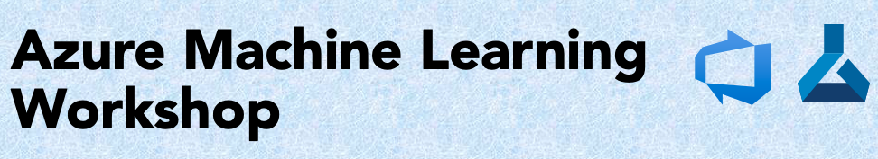

# Azure Machine Learning Workshop Template 
A template for e2e AzureML workshop 

## Prerequisites

For this workshop, all you need is access to an [Azure subscription](https://azure.microsoft.com/en-us/free/), an [Azure Machine Learning Workspace](https://docs.microsoft.com/en-us/azure/machine-learning/how-to-manage-workspace) that you'll create below (and [Azure DevOps](https://azure.microsoft.com/en-us/services/devops/)).

To run through the next sections, you will need an Azure subscription and an Azure ML workspace. See instructions on how to create a workspace [here](https://docs.microsoft.com/en-us/azure/machine-learning/how-to-manage-workspace).